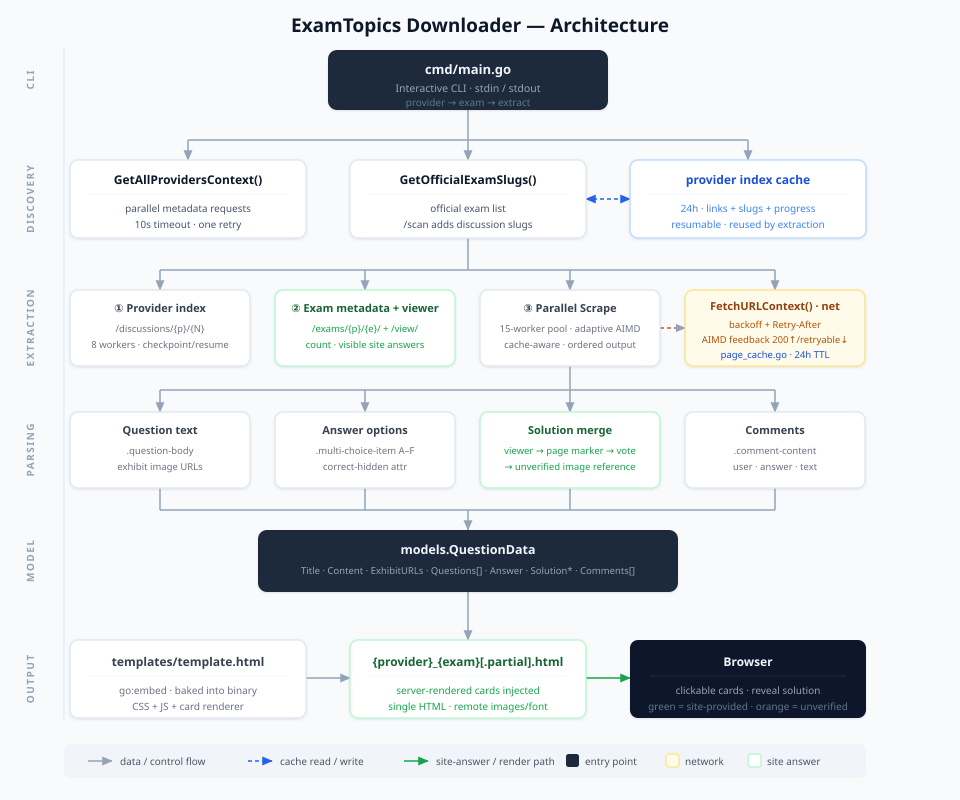

# ExamTopics Downloader (Enhanced Edition)

<p align="center">
  <a href="https://github.com/thatonecodes/examtopics-downloader">
    
  </a>
  <a href="https://go.dev/">
    
  </a>
  <a href="https://github.com/npapatheodorou/pretty-examtopics-downloader/releases/latest">
    
  </a>
</p>

> **This project is a fork of [thatonecodes/examtopics-downloader](https://github.com/thatonecodes/examtopics-downloader)**  
> Special thanks to [@thatonecodes](https://github.com/thatonecodes) for creating the original tool that made this possible.

---

## What is this?

**ExamTopics Downloader (Enhanced Edition)** is a command-line tool that saves
publicly accessible ExamTopics question pages as a study-oriented HTML file. It
does not unlock questions hidden behind login, CAPTCHA, subscription, or other
site access controls.

---

## Features

| Feature | Description |
|---------|-------------|
| **Download Public Questions** | Fetch discovered, publicly accessible question pages for a selected exam |
| **Clean HTML Output** | Beautiful, readable HTML format that's easy on the eyes |
| **Interactive Selection** | Browse and select exams with an easy-to-use menu |
| **Exam Simulation Mode** | Practice exams interactively with an HTML-based simulation |
| **Ready-to-Use .exe** | No need to install Go - download the pre-built executable and run it |
| **Cross-Platform** | Build from source for Windows, macOS, or Linux |

---

## Quick Start (Windows)

### Option 1: Use a Published .exe (Easiest)

1. Go to the [Releases](https://github.com/npapatheodorou/pretty-examtopics-downloader/releases) page
2. Download the latest `examtopics-downloader-windows-amd64.exe`
3. Double-click to run - no installation needed!

Published releases can lag the current source branch. Check the release date and
notes; build from source when you need changes that have not been released yet.

### Option 2: Build the Current Source

If you have [Go installed](https://go.dev/dl/):

```bash
git clone https://github.com/npapatheodorou/pretty-examtopics-downloader.git
cd pretty-examtopics-downloader
go build -o examtopics-downloader.exe ./cmd
```

Or use the included build script:

```bash
build.bat
```

---

## How to Use

### Running the Tool

Simply double-click the `.exe` file (or run from terminal):

```
examtopics-downloader-windows-amd64.exe
```

### Step-by-Step

1. **Select a Provider**  
   Choose your certification vendor (e.g., AWS, Azure, CompTIA)

2. **Select an Exam**  
   Pick the specific exam or exam series you want to download

3. **Wait for Download**  
   The tool fetches every matching public question page discovered so far. If the
   provider scan is incomplete, the output is clearly named `*.partial.html` and
   the next run resumes the cached scan.

4. **Open the Output**  
   Find the generated `.html` file in the same folder and open it in your browser

### Output Files

- **`provider_examname.html`** - Output produced after complete link discovery
- **`provider_examname.partial.html`** - Recovered output from incomplete discovery or extraction; resume before treating it as complete
- Open the HTML file in any browser to view, print, or study

---

## Sample Workflow

The counts and available exam codes vary as ExamTopics changes. This example
focuses on the inputs you type.

```
============================================================
 ExamTopics Downloader - Interactive Exam Extractor
============================================================

[INFO] Loading providers from ExamTopics...
[OK] Done. Found ... provider(s).

--------------------------------------------------------
 Available Providers
--------------------------------------------------------
 Enter one item, then press Enter:
   microsoft   Find providers containing microsoft
   1           Select displayed item 1
Provider> microsoft

Showing 1 of ...
  1. Microsoft
Provider> 1

Exam> az-305
Showing 1 of ...
  1. az-305
Exam> 1
```

---

## How It Works (Plain English)

This section is for people who just want to **understand what the tool does** without reading any code. If you're a developer, you can skip to *Technical Details*.

### Where the questions come from

The downloader uses two relevant kinds of public ExamTopics pages:

1. **Discussion pages** — when present and publicly accessible, these contain a
   question, its choices, answer markers, and possibly comments.
2. **The exam viewer** — `/exams/<vendor>/<exam>/view/` provides ExamTopics'
   viewer answers for an initial public subset. Later pages may require additional
   site access.

For a specific selected exam, the tool combines both sources when they are
available. `/all` has no single exam code, so that mode uses indexed discussion
pages without a viewer-answer lookup.

### What you see in the output HTML

Every extracted question becomes a **card** in the HTML file. A card has four parts:

1. **The question text and any pictures**  
   This comes from the discussion page.
2. **The answer area**  
   This is the part that's different depending on the question type (see below).
3. **The "Sneak Peek" button**  
   Click it to reveal the best answer signal the downloader recovered, subject to
   the source-confidence limits below.
4. **The "Comments" button**  
   Opens a list of what other users said in the discussion. It can provide useful
   alternative reasoning, but community comments are not authoritative.

### Three kinds of questions

ExamTopics uses three styles. The tool handles each one differently.

**1. Normal multiple-choice (most questions)**  
You see A, B, C, D options. Click one. The Sneak Peek shows which one is right.

> *Example:* "What is Azure? A) A cloud platform. B) A drink. C) A color. D) A car."

**2. HOTSPOT / Drag-and-drop (picture answers)**  
The question shows a picture (like a table or a diagram with dropdown menus). The correct answer is *another* picture showing the right selections filled in.

> *Example:* Question shows an empty table; the answer shows the table with the correct values picked.

If the public viewer supplied an answer for this question, you see a green block
titled **"Correct Answer"** with the solved picture and any explanation the site
provides. This means “site-provided,” not independently verified by the project.

**3. Picture-only options (some questions)**  
The A/B/C/D choices are pictures, not words. The tool keeps them as clickable images.

### Where the displayed answer comes from

The tool uses four signals, in this preference order:

1. **ExamTopics viewer “Reveal Solution”** (preferred)
   This is the answer ExamTopics shows on its viewer page. The output marks this
   with a green **"Correct Answer"** label; the project does not independently
   verify it against the certification provider.
2. **A hidden marker on the discussion page**  
   For normal multi-choice questions, the discussion page tags the correct option with a hidden class. The tool reads that.
3. **Most-voted community answer**, when its tally can be parsed.
4. **Question-side answer-area picture** (not an answer)
   For HOTSPOT questions where no answer is available, the tool shows the
   question's own image as a guide and labels it **"Answer Area (unverified)"** in
   orange. It must not be treated as a solved answer.

### Why some questions show "(unverified)"

ExamTopics typically exposes viewer answers only for an initial public subset. The
tool can use only what the site returns without additional access. For an
image-based question without a viewer answer, the question image may be displayed
as an explicitly *unverified* reference—not as a substitute correct answer.

### What happens behind the scenes

Step by step, when you run the tool:

1. **Pick the vendor** (Microsoft, AWS, etc.) from a menu.
2. The official exam list appears first. Pick an exam immediately, use `/scan` to
   discover discussion-only exams, or use `/all` to include every indexed public
   discussion for the provider.
3. A discussion scan uses eight workers, shows real page progress, stops after two
   minutes, and checkpoints partial results so a later scan resumes where it left off.
   A partial scan is not reported as a complete question set.
4. The resulting provider index is reused to find question pages; the same listing
   pages are not downloaded again for extraction.
5. It fetches the exam landing page for the advertised count and the **viewer
   page** once for the site answers currently exposed to an anonymous request.
6. It fetches question pages through a fixed worker pool with adaptive, polite rate
   limiting. Cached pages return immediately.
7. If a request is rate-limited, the tool waits once and retries within a bounded policy.
8. Each question is bundled into one card and written to the output HTML.
9. You open the HTML in any browser. Done.

### Question-count and access limits

“Exam codes found” is the number of different certifications discovered across a
provider; it is not the number of question sets for the selected exam. For a
specific exam, the downloader reports three separate figures: provider listing
pages scanned, public discussion-backed question pages found, and the total number
of questions advertised by ExamTopics.

The advertised total can be larger than the downloadable total. ExamTopics may
not provide a public discussion page for every question, and its anonymous exam
viewer exposes only an initial subset before requiring site access. This project
does not bypass login, CAPTCHA, subscription, or other access controls.

Download time depends on exam size and ExamTopics throttling. Repeated runs are
normally much faster because both the provider index and question pages are cached.

### What to do if something looks wrong

- **Picture missing?** Refresh the HTML or check your internet — pictures load from ExamTopics' servers.
- **Wrong answer?** Compare the viewer answer, discussion markers, and comments;
  none is independently certified by this project.
- **Question missing?** Check whether the file name ends in `.partial.html`. Run
  again or use `/scan` until provider discovery completes. `-debug` can identify
  failed URLs, but advertised questions behind site access controls remain unavailable.

---

## Improvements Over the Original

This fork includes several enhancements over the original [examtopics-downloader](https://github.com/thatonecodes/examtopics-downloader):

- **Broader Exam Discovery** - Combines the official exam list with resumable public-discussion discovery
- **Resolved Minor Issues** - Bug fixes and stability improvements
- **Better Usability** - Improved user experience for non-technical users
- **Compiled .exe Release** - No need to install Go; download and run
- **HTML Exam Simulation** - Practice exams in an interactive browser-based format
- **Enhanced Filtering** - Type search text directly (for example `az-305`), or use `/filter az-305`

### Recent fixes (newbie-friendly summary)

- **No silent completeness claim.** Parseable image-heavy pages are retained, and
  incomplete discovery or failed page extraction produces explicit warnings and a
  `.partial.html` filename.
- **Picture-based answers are now visible.** HOTSPOT and drag-and-drop questions used to show a confusing *"no answers found"* message. They now show the picture as the answer area with a clear label.
- **Viewer answers when available.** For questions ExamTopics exposes publicly,
  the tool captures *"Reveal Solution"* content—including solved pictures,
  explanations, and reference links—and identifies it as site-provided data.
- **Honest labels.** When a viewer answer is unavailable, an answer-area picture is
  labelled **"Answer Area (unverified)"** instead of being presented as verified.
- **Bounded retries when the website is busy.** Retryable server responses are
  retried within a fixed policy; exhausted failures are reported rather than hidden.
- **Clearer running output.** Discovery coverage, advertised question count,
  extracted pages, cache hits, retries, failures, and partial status are reported separately.

---

## Architecture



For a code-level walkthrough of the packages, request flow, answer trust order,
caches, retry behavior, output renderer, and known constraints, see
[PROJECT_OVERVIEW.md](PROJECT_OVERVIEW.md).

---

## Technical Details

### Requirements

- **Windows**: No additional requirements (pre-built .exe)
- **From Source**: Go 1.24.2+ (as declared in `go.mod`)

### Building

```bash
# Build for Windows (amd64)
go build -o examtopics-downloader.exe ./cmd

# Build for other platforms
GOOS=linux GOARCH=amd64 go build -o examtopics-downloader ./cmd
GOOS=darwin GOARCH=amd64 go build -o examtopics-downloader ./cmd
```

### Command-line flags

```text
-debug                    Enable diagnostic logs
-no-cache                 Bypass both provider-index and question-page caches
-refresh-index            Rebuild the provider discussion index but keep question pages cached
-recent-comments-days N   Filter by recent dated comments; unknown dates remain (0 disables)
-h, --help, /?            Show command-line and interactive-command help
```

When the flag is omitted, the program asks interactively. Leave that prompt blank
to keep all extracted questions. This filter measures comment activity, not the
question's publication date.

### Output Formats

The tool generates a single clean, styled HTML file that works in any modern browser.
Question cards, quiz logic, and comments are stored in the file; exhibit/answer images
and the Google Font remain remote resources and require network access. The HTML includes:
- A light certification-workbook theme with a remembered dark-mode toggle
- A live answered-question progress rail and responsive mobile layout
- Question text with proper formatting
- Multiple choice answers (A, B, C, D...)
- Answer feedback and source-confidence labels
- Explanation sections when supplied by the public viewer
- Clean, modern styling

---

## Disclaimer

This tool is for **educational purposes only**. ExamTopics content is copyrighted
material and may be subject to its terms of use. Use the tool only where you are
authorized to do so; it does not grant rights to copy or redistribute content.

---

## License

See [LICENSE](LICENSE) for details.

---

## Credits

- **Original Author**: [@thatonecodes](https://github.com/thatonecodes) - Thank you for creating this amazing tool!
- **This Fork**: Enhanced and maintained by the community

---

<p align="center">
  <strong>Good luck with your certification studies!</strong>
</p>
